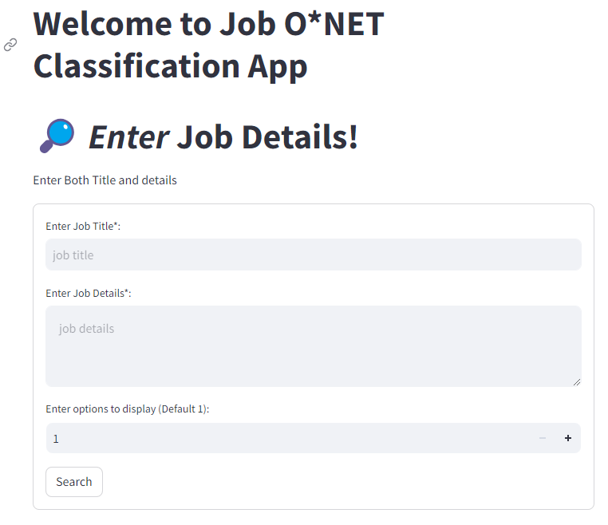
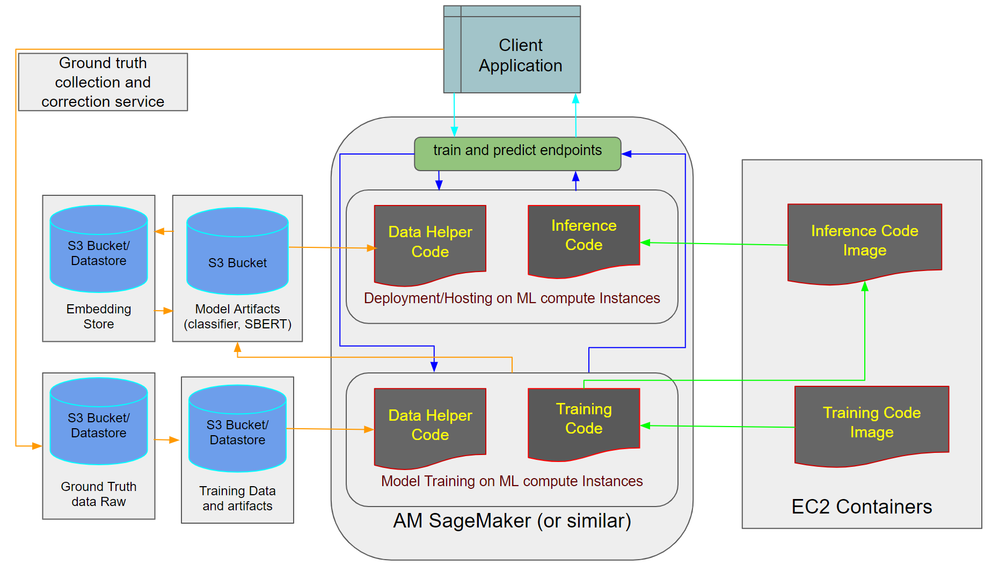

# Coding Exercise - [Intelligent O\*NET Mapping to Job Posting based on NLP Embeddings](https://job-classification.streamlit.app/)

## Task

This app is focused on classifying Job postings to corresponding O\*NET categories. The output is _top_k_ categories that are extracted by the ML Model.

## Demo App Screenshots

Here are some demo screenshots for the app and you can also try it using [this link](https://job-classification.streamlit.app/)<h6>(slow to load)</h6>

## Environment

This project is implemented using `Python 3.10`, [`Sentence Transformers`](https://www.sbert.net/index.html), `Scikit-Learn`, and `PyTorch`. Here, 2 different deployment approaches, Streamlit and FastAPI are demonstrated.

## Approach

<!-- ###### For detailed approach please read [docs/APPROACH.md](https://github.com/shriadke/Job-Classification/blob/main/docs/APPROACH.md) -->

The basic approach is as follows:

1. Data Cleaning:

    - Cleaning the text data inputs by removing non-contextual information such as punctuations, stop words, common job post vocabulary ("Description","Salary", etc.). This vocab can be obtained by finding frequent words (via code) and manually adding them to  [`special_words.txt`](https://github.com/shriadke/Job-Classification/blob/main/data/raw/special_words.txt)

    - Preparing the input string with custom tokens (title and body), and tokenize (with a pre-trained tokenizer for generating embeddings).

    - Given data does not contain all of the O\*NET, thus, all 1017 categories are downloaded from the given website and considered as [final categories](https://github.com/shriadke/Job-Classification/blob/main/data/raw/All_Occupations.csv). (_This is an *assumption_*)

2. Model basics:

    - Here the classifier model will consider SBERT embeddings generated from above step as a vector input.

    - Based on the model architecture output class representation is decided. The goal is to obtain top K (1 to 20) O\*NET Name strings (*Assumption*: id is not considered). 

3. Training:

    - Embeddings: This can be direct vectors from Sentence BERT's standard models. Here, I have fine-tuned these base models to given training data to obtain a custom embedding model. (Details can be found in [research/00_02_embeddings.ipynb](https://github.com/shriadke/Job-Classification/blob/main/research/00_02_embeddings.ipynb))

    - Classifier: I've considered basic classifiers for this problem; as the main goal is utilizing the above embeddings and comparison of outputs. The classifier demonstrated here are:
    
        * Semantic Search with cosine similarity and nearest neighbor algorithm to rank top_k results.
        * Logistic Regression classifier over all O\*NET categories available on the website.        

    - For both the classifiers, training data is split into train and val sets to obtain the val set during training.

    - For more details on these, please refer [research/00_03_classifier_research.ipynb](https://github.com/shriadke/Job-Classification/blob/main/research/00_03_classifier_research.ipynb). 

4. Evaluation:

    - Classification metrics during validation: Accuracy, Precision and Recall for k=1, i.e. the actual label.

    - Recommendation metrics during testing: Top_k_accuracy, Top_k_recall, Top_k_precision, Mean Reciprocal Rank.

    - If a single combination of job post belongs to multiple categories, then one can use other recommendation metrics based on ranks such as NDCG. However, for a given data, a single combination of Job Title and Body belonged to a single category. Therefore, Top_k metrics with Recall and Accuracy are considered to be the most effective here. 

5. Prediction:

    - `predict()` is used to perform the testing on custom Job data. The method takes in 3 paramaters: Job title, body, and top_k. This then calls the prediction pipeline which follows the above steps in inference mode. The custom trained model is used to generate input embedding vectors and the output is list of top_k categories from all 1017 O\*NET categories available. This API is exposed using 2 approaches: 
    
        * [Streamlit App](https://job-classification.streamlit.app/) via [`app.py`](https://github.com/shriadke/Job-Classification/blob/main/app.py)
        * FastAPI localhost integration via [`app_api.py`](https://github.com/shriadke/Job-Classification/blob/main/app_api.py). This also contains endpoint to run embedding training pipeline.

    - More details on how to use and test locally are given in upcoming [Usage section](https://github.com/shriadke/Job-Classification#usage).

#### ***_WARNING_*: For the data, model and other artifacts such as saved embeddings--> some paths may be broken as I was not able to upload all data into github due to their size. Therefore, if running locally, make sure the filepaths and the corresponding variables are properly loaded/initialized.  

## Brief on EDA, Training and Evaluation performance

### 1. Data Analysis

Following are the stats for given train/test data:

    - #training examples available = 17,927
    - #distinct O\*NETs in train_data = 699 

    - #testing examples available = 19,394
    - #distinct O\*NETs in test_data = 708

    - #Total O\*NETs available online = 1017
    - #O\*NETs from train+test data = 805 
    - #O\*NETs common in train+test data = 602

Due to the inconsistency in O\*NETs in both sets, I decided to download the original list of all avaliable(1017) O\*NETs and stored in [data/All_Occupations.csv](https://github.com/shriadke/Job-Classification/blob/main/data/All_Occupations.csv). This file will be used for further process, including the given classification task.

More details can be obtained in [research/00_01_EDA.ipynb](https://github.com/shriadke/Job-Classification/blob/main/research/00_01_EDA.ipynb). 

### 2. Embedding

Initial training of a classifier using the [given Sentence transformer model](https://huggingface.co/sentence-transformers/all-MiniLM-L6-v2) resulted in poor accuracy score (22%) over top 10 returned results which is much lower and was not ideal even for a base model. Thus, I finetuned another SBERT model specific to the given training data.

This model was trained with multiple approaches and tuned using different loss functions/evaluators available in SBERT library. Our data is in the from of `<query, search_result>` which mimics [asymmetric semantic search](https://www.sbert.net/examples/applications/semantic-search/README.html#semantic-search) in a broad way with Long query description and a short search result. This type of problem is well tackled by another type of SBERT model trained on [MS-MACRO](https://www.sbert.net/examples/training/ms_marco/README.html) dataset. _This is an assumption to mold the given data into a relevant embedding training format. Other formats may work equally or better._ Therefore, here I've selected [`sentence-transformers/msmarco-distilbert-base-v4`](https://huggingface.co/sentence-transformers/msmarco-distilbert-base-v4) as a base model to finetune.

For training, 85% of train_data was used and 15% was used to perform evaluation as per [InformationRetrievalEvaluator](https://www.sbert.net/docs/package_reference/evaluation.html#sentence_transformers.evaluation.InformationRetrievalEvaluator). The best model obtained gave following performance (computed with semantic search) on validation and test sets, _each tuple represents value for (__val, test__)_:

| metric\K | 1    | 5    | 10    |
| :---:   | :---: | :---: | :---: |
| __Accuracy@K__ | (0.61, 0.53)   | (0.78, 0.75)   | (0.89,0.81)   |
| __Precision@K__ | (0.61, 0.53)   | (0.21, 0.15)   | (0.12,0.08)   |
| __Recall@K__ | (0.61, 0.53)   | (0.78, 0.75)   | (0.89,0.81)   |
| __MRR@K__ | (0.61, 0.53)   | (0.66, 0.61)   | (0.67,0.61)   |

Given the good performance i.e. Accuracy@k, and Recall@k was high at k=1 and improves significantly with increase in k., I decided to checkpoint this model for further embedding computation for the classifiers. This model can be downloaded from HuggingFace's model hub at [shriadke/adept-job-msmarco-distilbert-base-v4](https://huggingface.co/shriadke/adept-job-msmarco-distilbert-base-v4) (Repo is not updated so only base model trained for 2 iterations is uploaded).

### 3. Classifier

1. Semantic Search model (best/saved): This is same model trained above for embedding retrieval and appended with a [semantic search](https://www.sbert.net/docs/package_reference/util.html#sentence_transformers.util.semantic_search) step to obtain top_k results. 
    - Input classes = Embeddings of saved 1017 O\*NETs
    - Input Features = Embeddings of cleaned job posts from different sets
    - score function = 'cosine-similarity' , 
    - total_epochs = 2,
    - train time = ~8 hours on CPU with 8 GB RAM
    - Model evaluation was same as embedding training evaluation reported above. 
  
2. Logistic Regression model (best/saved): Basic Scikit-learn classifier with input as embeddings.
    - Input classes = 1017 O\*NETs mapped to integer ID,
    - Input features = Embeddings of cleaned job posts from different sets
    - solver = 'sag' , 
    - Multinomial LR with L2 penalty,
    - max_iter = 20,
    - train time = ~12 mins on CPU with 8 GB RAM
    - Model Accuracy@k (Recall was relative to accuracy, and thus, not shown)
    
    | set\K | 1    | 5    | 10    |
    | :---:   | :---: | :---: | :---: |
    | __val__ | 0.71   | 0.88   | 0.91   |
    | __test__ | 0.68   | 0.87   | 0.91   |

Overall, the basic LR classifier improved the k=1 metrics significantly and can be further enhanced using different classification heads. Therefore, this was selected to demonstrate the prediction pipeline.

### 3. Evaluation on test data

To investigate low performance at k=1 with the test data, I thouroughly checked the given labels for O\*NET Names. During initial go-through it can be seen that, some of them were wrongly classified. Therefore, it was essential to consider more recommendations based on classifier output probabilities. Assuming the training data had correct labels, the embedding model trained with SBERT architecture, helped resolving this issue with test data. The correct (according to me) O\*NET was seen at the top of results while the given label was seen amongst top 10. This is the reason of having high performance at k=10 and lower values at k=1 in the classifiers. Following example shows this disparity:

## File Structure
The folder structure is taken from an open-source project repository and I've been using the same throughtout my professional career for various end-to-end projects. It follows standard best practices to software engineering and MLOps along with the pipeline that can be reused with various cloud platforms. The details for each folder is given at the end. Following are the generic files and sample description: 

1. [app.py](https://github.com/shriadke/Job-Classification/blob/main/app.py)
	This is the main app file used to build the `streamlit` app implementation of Job-Classification app that uses `predict()` method to obtain the list of O\*NETs.

2. [app_api.py](https://github.com/shriadke/Job-Classification/blob/main/app_api.py)
	This is the another implementation of Job-Classification API built with the `FastAPI` package. This contains 2 main APIs:
	- `/train`: To run the embedding training pipeline using UI provided by FastAPI.
	- `/predict`: To get the list of offers using the model trained above (This will need to reset the prediction params manually to newly trained model).

3. [main.py](https://github.com/shriadke/Job-Classification/blob/main/main.py)
	This is the Python module that encapsulates all the different methods performed in this pipeline. This module is further used by the API service in the above [app_api.py](https://github.com/shriadke/Job-Classification/blob/main/app_api.py) to orchestrate different stages in deployment. 

4. [src/jobClassification](https://github.com/shriadke/Job-Classification/blob/main/src/jobClassification/)
	This is the main project module with all the components, configs, pipelines and other supporting code. This will be generated as source package after [`setup.py`](https://github.com/shriadke/Job-Classification/blob/main/setup.py) is executed.

5. [requirements.txt](https://github.com/shriadke/Job-Classification/blob/main/requirements.txt)
	This file contains the necessary packages required for this project.

6. [Dockerfile](https://github.com/shriadke/Job-Classification/blob/main/Dockerfile)
	This file contains build instructions for API deployment using Docker. This step is not functional at this point.

7. [data/](https://github.com/shriadke/Job-Classification/blob/main/data/)
	This folder contains all raw and processed data along with embeddings.

8. [research/](https://github.com/shriadke/Job-Classification/blob/main/research/)
	This folder contains all the research steps performed before incorporating the code into src.

### Training Pipeline workflow

The training pipeline is invoked using [`main.py`](https://github.com/shriadke/Job-Classification/blob/main/main.py). There are 5 basic pipelines in the given order: `Data Ingestion --> Data Validation --> Data Transformation --> Model Trainer --> Model Evaluation` , and a separate Prediction pipeline is provided for `predict()` method. 

Steps to create a pipeline are listed in [docs/workflows.md](https://github.com/shriadke/Job-Classification/blob/main/docs/workflows.md). Following are the main files involved in any given pipeline from `main.py`:

1. `<Name>Pipeline()` class: Invokes the corresponding pipeline configuration from [`configuration.py`](https://github.com/shriadke/Job-Classification/blob/main/src/jobClassification/config/configuration.py) and required [`component`](https://github.com/shriadke/Job-Classification/blob/main/src/jobClassification/components) methods.
2. [`configuration.py`](https://github.com/shriadke/Job-Classification/blob/main/src/jobClassification/config/configuration.py) : File to define and load all the required configurations for different pipelines. This includes the [`entities`](https://github.com/shriadke/Job-Classification/blob/main/src/jobClassification/entity/__init__.py) defined in [`config.yaml`](https://github.com/shriadke/Job-Classification/blob/main/config/config.yaml).
3. [`components`](https://github.com/shriadke/Job-Classification/blob/main/src/jobClassification/components/) : This is the main folder that contains corresponding pipeline's business logic and necessary callable method implementations.
4. [`utils/common.py`](https://github.com/shriadke/Job-Classification/blob/main/src/jobClassification/utils/common.py) : Provides common methods implementation used across the project such as file download, cleaning, embedding loading, processing, etc.

This architecture can be modified as per the project's overall needs to follow standard software engineering practices.

Following figure shows the basic system that can be implemented for this (details in [docs/USAGE.md](https://github.com/shriadke/Job-Classification/blob/main/docs/USAGE.md)):

## Usage

Apart from the demo above, if you wish to run the project locally, then follow the steps below:

- Clone this repo using `git clone  https://github.com/shriadke/Job-Classification`.

- As described in [File Structure](https://github.com/shriadke/Job-Classification#file-structure), you can verify the files.

- Create an environment using  `conda create -n jobClass python=3.10`

- Activate the above environment `conda activate jobClass`

- Install all packages `pip install -r requirements.txt`

- To view the streamlit app, run `streamlit run app.py`

- To use FastAPI interface, run `python app_api.py`

The Search App will be deployed on your chosen platform. 

### *Have some fun with it, because I did :wink: !!*

More details on excecution methods for training/deployment can be found in [Usage.md](https://github.com/shriadke/Job-Classification/blob/main/docs/Usage.md)

## Future Work

In future, given more-time and additional data, one can build a stable app that does the task as above with highest accuracy and great details. Following are some areas of improvements in my approach:

1. Better Embeddings

	- Current approach truncates additional tokens thus loosing a lot of information. This can be avoided by summarizing the posting.
    - The current approach just uses given texts to build a string for the embeddings. It can be further enhanced by incorporating the various aspects of the job posts such as skills, requirements, responsibilities, etc. With these aspects, we can customize the input string before generating the embeddings.
	
2. Improved Data Cleaning
	
	- Though I have demonstrated embedding model training, the current model and the data used for training is not ideally curated. Some of the posting were truncated and info was lost. However, even with that model gives good embeddings.
    - Additional details can be added in special tokens file to eliminate the words from the raw text.
	- There needs to be thorough research into annotations and forming JOB_POST <-> ONET_NAME mappings.
	- We can leverage annotation platform and experiment with various types of annotations.
	
3. Improved Classification Model

	- The current semantic search model is based off sentence_transformers given architecture and thus limited in multiple ways for the task at hand.
    - For the logistic regression classifier, only cleaned job post was embedded and mapped to 1017 O\*NET classes. This can be enhanced with different approaches:
        - Relevant metadata can be added as a separate input text/feature that can help improve classifier's performance. This metadata can be job poster, company info, etc.
        - More examples to balance under-represented classes.
        - Human-augmented training: A UI which uses above model and gives user coarse suggestions for O\*NETs and then user can select the most appropriate out of the given top_k, which then will be added to the training data for continuous training.
	- Given the resources, and better data, a similar model- with modifications (if any)- can be trained from scratch. Example candidates can be a custom neural network with Embeddings as features and O\*NET class as an output. 
    - The semantic search model can be enhanced with additional classification layer after the pooling layer to create a custom training objective with given data, this will eliminate the need of balancing the data and will classify the posts into any list of category based on embedding similarity, given the list is moderately large.
    - If the scope of project is to be expanded with additional research and complex classifier architectures, a good starting point can be [this Job Title Classification Paper](https://arxiv.org/pdf/2202.10739.pdf#:~:text=The%20main%20idea%20of%20JAMES,of%20a%20resume%20are%20extracted.) We can build a multi-layer embedding system that captures different contexts in the given Job post and combines them with an attention mechanism to generate a dense vector corresponding to all O\*NET classes.

4. Enhanced pipeline:
    
    - The current repo shows a basic demo of embedding training pipeline within the local environment. This can be scaled up to utilize cloud infrastructure and leverage those to curate/generate the data, train large models, and monitor the performance efficiently.
    - The prediction pipeline as demonstrated can be deployed on open-source servers/platforms. These can be protected with services such as AWS to ship and deploy in a more sophisticated way.
    - Custom ground-truth generation and monitoring pipeline can be implemented in a similar way to improve the model in the live state by using the user feedback as a training data which then will trigger a training pipeline (with some triggering interval) to adjust the new/misclassified input in the current model.

With all the above improvements/ additional work, this same pipeline can be used to productionize a fully-functioning O\*NET classification App/platform!!

## Thanks for Visiting!!
	
