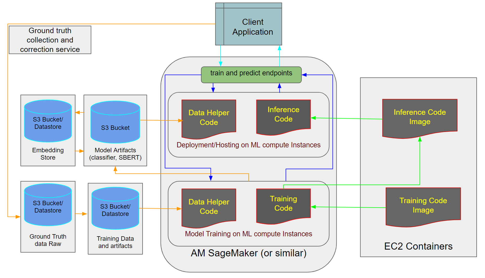

# Using Trainng Pipeline

## Command Line

Easiest way to perform the training pipeline is to run [`main.py`](https://github.com/shriadke/FetchSearch/blob/main/main.py). Make sure the data is in proper location for ingestion.

## Using FastAPI

After running `app_api.py`, select the `/train` route in the UI opened in localhost and execute it. This should perform training pipeline on the local device.

Sample Prediction can be done using the `/predict` route as follows: 

## Using AWS deployed App

This is an option to be performed in future to perform above operations at scale on cloud. 
- The client app provides User interface to invoke training and prediction pipelines. Also, it will provide an external service that tracks newly found or user corrected data with ground truth to ensure continuous model improvement.

- Separate EC2 instances can be leveraged as containers for training and inference code, which will be fetched into the orchestration tool upon request.

- Simple GitHub actions based CI/CD pipeline can be helpful in the start and with the scale we can shift to SageMaker or related tools.

- The Orchestration platforms extracts code instances and interacts with given data, model artifacts.

- Project artifacts includes:
    * Raw train, test data with/without ground truth
    * Processed/cleaned data for training
    * Pre-computed embeddings such as O*NET category embeddings
    * Custom Embedding model checkpoints
    * Classifier model checkpoints

Following figure shows the system that can be implemented for this:

